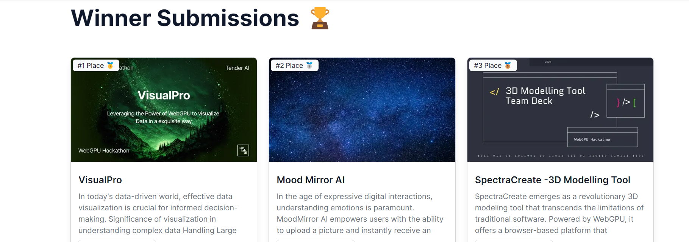

# WebGPU Backend with Data Visualization

This is the original repo that won the [lablab.ai WebGPU Hackathon](https://lablab.ai/event/webgpu-hackathon) that was transfered to the team repo [Tender AI](https://github.com/Fayaz-khani/WebGPU_Hack) so the team can make their contributions and turn it into the best project that eventually won: **VisualPro**




This project serves as the backend for a WebGPU application. It's designed to process user input, simulate it with WebGPU, and then send the results to the frontend to be visualized using Three.js for 3D bar chart representation.

## Getting Started

### Prerequisites

- Node.js
- npm
- SQLite (integrated)

### Installation

1. Clone the repository:
   ```bash
   git clone https://github.com/djpapzin/webgpu-backend.git
   ```

2. Navigate to the project directory:
   ```bash
   cd webgpu-backend
   ```

3. Install the required packages:
   ```bash
   npm install
   ```

### Running the Server

To start the server, run:

```bash
node server.js
```

The server will start, and you should see a message indicating it's running on `http://localhost:3000`.

## Usage

1. Visit `http://localhost:3000/input.html` to input data.
2. Submit the data, which will be processed and stored in the SQLite database.
3. Visit `http://localhost:3000/index.html` to view the visualized data in a 3D bar chart.

## API Endpoints

- **POST /process-data**: Accepts user input for processing and stores it in the SQLite database.
- **GET /get-data**: Returns the processed data from the SQLite database to be visualized on the frontend.

## Future Work

- Integrate WebGPU for data processing.
- Enhance the API for more complex simulations.
- Implement error handling and validation for user input.
- Extend visualization capabilities, including 3D visualization options.

## Database

The project uses SQLite for data storage. This provides a lightweight solution for storing and retrieving user input data.

## Contributing

Pull requests are welcome. For major changes, please open an issue first to discuss what you would like to change.

## License

This project is licensed under the ISC License.